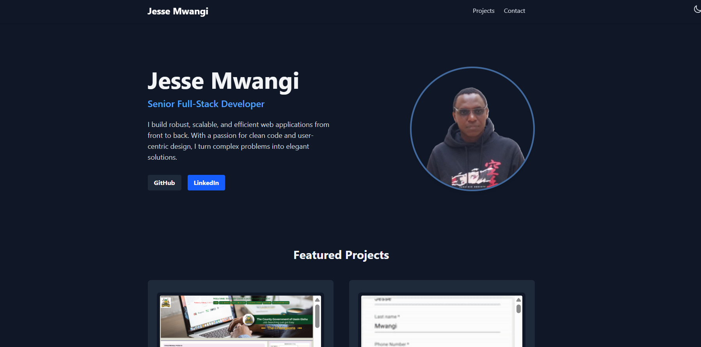

# Senior Full-Stack Developer Portfolio



Welcome to the source code for my personal portfolio. This project was built to showcase my skills, feature my best work, and serve as a central point of contact for recruiters and potential collaborators. It's a clean, modern, and fully responsive single-page application built with a powerful and efficient tech stack.

**Live Demo:** [**jesse-mwangi-portfolio.com**](https://folio-jesse.vercel.app/)

---

## ✨ Key Features

* **Modern & Clean UI:** A minimalist design that puts the focus on the content.
* **Project Showcase:** A dedicated section to display my featured projects with live links and source code.
* **Responsive Design:** Looks and works great on all devices, from mobile phones to desktops.
* **Dark Mode:** A sleek, user-friendly dark theme that respects user preferences and can be toggled manually.
* **Contact Form:** A functional contact section for easy communication.
* **Optimized Performance:** Built with Vite for lightning-fast development and optimized production builds.

---

## 🛠️ Tech Stack

This project is built using the latest web technologies to ensure a robust and maintainable codebase.

| Technology      | Description                                                                                    |
| :-------------- | :--------------------------------------------------------------------------------------------- |
| **Vite** | A next-generation frontend tooling that provides a faster and leaner development experience.     |
| **React** | A JavaScript library for building user interfaces, used here for its component-based architecture. |
| **TypeScript** | A superset of JavaScript that adds static typing, improving code quality and developer experience. |
| **Tailwind CSS**| A utility-first CSS framework for rapidly building custom designs without leaving your HTML.      |
| **Framer Motion**| (Optional: Add if you include animations) A production-ready motion library for React.           |
| **Vercel/vercel**| Deployed for fast, global hosting and continuous integration.                                  |

---

## 🚀 Getting Started

To run this project locally, you'll need to have Node.js and npm (or yarn) installed on your machine.

### 1. Clone the Repository

First, clone the repository to your local machine using Git:

```bash
git clone [https://github.com/Jessemwangi/folio.git](https://github.com/Jessemwangi/folio.git)
cd folio
```

### 2. Install Dependencies

Next, install all the necessary project dependencies:

```bash
npm install
# or
yarn install
```

### 3. Run the Development Server

Once the dependencies are installed, you can start the local development server:

```bash
npm run dev
# or
yarn dev
```

The application will now be running on `http://localhost:5173` (or the next available port).

## 📂 Project Structure

The project follows a standard Vite + React structure, with components and data organized for clarity and scalability.

```bash
/
├── public/
│   ├── assets/
│   │   └── project-images.png
│   └── jesse-photo.jpg
├── src/
│   ├── components/
│   │   ├── Header.tsx
│   │   ├── Hero.tsx
│   │   ├── ProjectsList.tsx
│   │   ├── ProjectCard.tsx
│   │   ├── Contact.tsx
│   │   |── Footer.tsx
|   |   |__ThemeProvider.tsx
│   ├── data/
│   │   └── projects.ts
│   ├── App.tsx
│   ├── index.css
│   └── main.tsx
├── .gitignore
├── index.html
├── package.json
├── README.md
├── tailwind.config.js
└── tsconfig.json
```

---

## 🌐 Deployment

This portfolio is deployed on **Vercel** (or Netlify, etc.). The deployment process is automated through a CI/CD pipeline that triggers on every push to the `main` branch, ensuring the live site is always up-to-date with the latest changes.

---

## 👋 Get In Touch

I'm always open to discussing new projects, creative ideas, or opportunities to be part of an ambitious vision.

* **LinkedIn:** [@jesse-mwangi](https://www.linkedin.com/in/jesse-mwangi/)
* **Email:** [jessejzee@gmail.com](mailto:jessejzee@gmail.com)

Thanks for checking out my portfolio!
